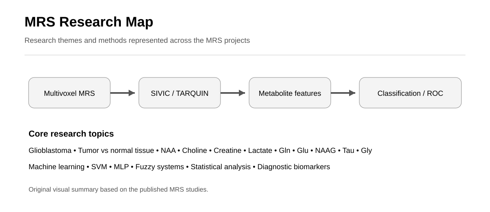

# MRS Research



This repository provides a central overview of my research experience in magnetic resonance spectroscopy (MRS), with a focus on brain tumor imaging, metabolite analysis, signal processing, and machine learning-based classification.

## Research Themes

- Multivoxel magnetic resonance spectroscopy
- Glioblastoma multiforme (GBM)
- Brain metabolite analysis
- MRS signal processing
- Metabolite quantification
- Machine learning classification
- Support vector machines (SVM)
- Medical imaging

## Selected Projects

### MRS and Metabolite Analysis

[Analysis of Glioblastoma Multiforme Tumor Metabolites Using Multivoxel Magnetic Resonance Spectroscopy](https://github.com/AyobFaramarzi/MRS-Glioblastoma-Metabolite-Analysis)

This project examines multivoxel MRS data from glioblastoma patients, including metabolite quantification, metabolite ratios, statistical comparisons, and ROC-based diagnostic analysis.

### MRS and Machine Learning

[Semi-Automated Glioblastoma Tumor Detection Based on Different Classifiers Using Magnetic Resonance Spectroscopy](https://github.com/AyobFaramarzi/MRS-Glioblastoma-Machine-Learning)

This project examines MRS-derived Cho and NAA features with multilayer perceptron, linear SVM, Gaussian SVM, and fuzzy classification approaches for tumor-versus-non-tumor voxel discrimination.

### Earlier MRS Work

**Detection of Glioblastoma Multiforme Tumor in Magnetic Resonance Spectroscopy Based on Support Vector Machine**

This earlier study represents the initial stage of my MRS-based tumor detection and machine learning work using Support Vector Machine classification.

## Research Workflow

```text
Magnetic Resonance Spectroscopy
        ↓
Voxel / Region Identification
        ↓
Water Suppression and Signal Processing
        ↓
Metabolite Quantification
        ↓
Feature Extraction
        ↓
Statistical Analysis / Classification
        ↓
Diagnostic Evaluation
```

## Software and Methods

- TARQUIN
- SIVIC
- MATLAB
- SPSS
- Machine Learning
- Support Vector Machines
- Multilayer Perceptron
- Fuzzy Classification
- ROC Analysis

## Author

**Ayob Faramarzi**

Biomedical Engineering | Neuroimaging | fMRI | MRS | Brain Connectivity | Machine Learning

[GitHub Profile](https://github.com/AyobFaramarzi)
